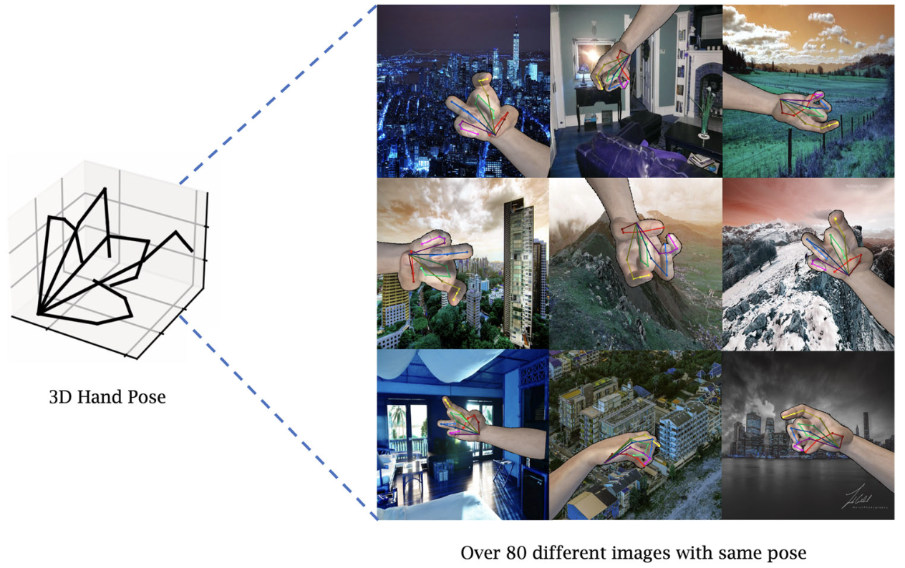
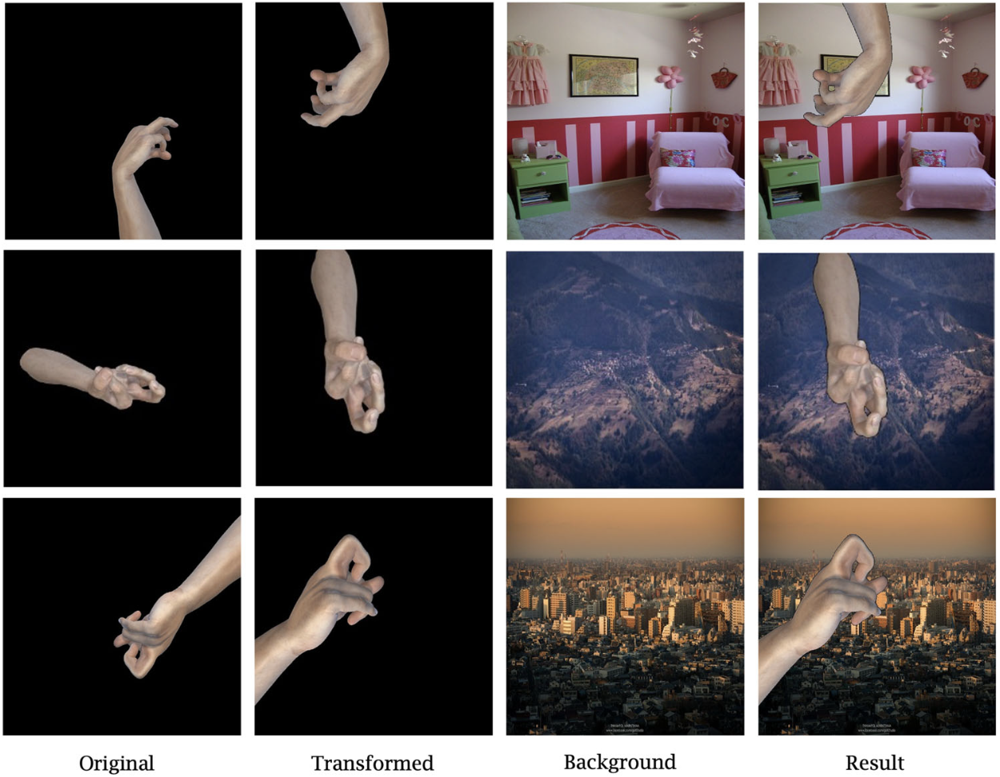

<div align="center">

# Enhancing 3D Hand Pose Estimation Using SHaF

### Synthetic Hand Dataset Including a Forearm

[](https://doi.org/10.1007/s10489-024-05665-x)
[](https://github.com/leejeongho3214/LightHand)
[](mailto:72210297@dankook.ac.kr)

**Jeongho Lee**¹ · Jaeyun Kim¹ · Seon Ho Kim² · Sang-Il Choi¹

¹ Dankook University, South Korea &nbsp;&nbsp;·&nbsp;&nbsp; ² University of Southern California, United States


</div>

---

## 📌 Overview

A transformer-based model that estimates 3D hand pose **without any 3D mesh annotation**, yet outperforms mesh-based state-of-the-art methods — trained with **SHaF**, a synthetic hand dataset that includes the forearm.

Two ideas carry the result:

| | Contribution | Why it matters |
| --- | --- | --- |
| **1** | **SHaF** — a Unity-generated synthetic hand dataset that renders the **forearm** together with the hand | Real-world images almost always contain the forearm. Cropping it away, as most synthetic sets do, creates a domain gap at inference time. |
| **2** | **Mesh-free architecture** (PGB + APEM) | Removes the dependency on MANO mesh annotations while improving both accuracy and inference speed. |

---

## 🖐️ The SHaF Dataset

| Property | Value |
| --- | --- |
| Poses | 9,000 |
| Camera presets | 82 |
| Total RGB images | **738,000** |
| Forearm | Included |
| Joint ranges | Biomechanically validated |
| Pose distribution | Uniform (verified by t-SNE) |
| Augmentation | Background replacement + geometric/photometric transforms |

<div align="center">
  
  
  <br>
  <sub>Left: SHaF samples. Right: augmentation examples.</sub>
</div>

> [!NOTE]
> The rendered SHaF images are **not distributed** as a fixed download.
> The dataset is defined by the generation recipe above — pose sampling, the 82-preset camera rig, forearm inclusion and augmentation — so that you can synthesize a set matched to *your* camera geometry, hand models and background domain rather than inheriting ours.
> If you would like the generation details or the Unity setup, please [get in touch](mailto:72210297@dankook.ac.kr).

---

## 🧠 Method

<table>
<tr>
<td width="50%" valign="top">

**Pose Graph Block (PGB)**

Treats the 21 hand joints as a graph and propagates features along the joint adjacency, so the network reasons about the kinematic relationship between joints instead of predicting each one independently.

</td>
<td width="50%" valign="top">

**Auxiliary Pose Estimation Module (APEM)**

Adds a 2D-supervision branch that shortens the gradient path to the backbone, stabilising training and sharpening the intermediate features the 3D head consumes.

</td>
</tr>
</table>

Together they replace the mesh-regression head used by METRO and MeshGraphormer — no MANO mesh, fewer parameters, ~2× faster inference.

---

## 📊 Results

Metrics: **PA-MPJPE** (mm, lower is better) and **AUC** of the PCK curve (higher is better).

### Headline

| | PA-MPJPE ↓ | Speed ↑ | Mesh needed |
| --- | --- | --- | --- |
| MeshGraphormer | 5.9 mm | 12.50 fps | ✓ |
| **Ours** | **5.2 mm** | **23.31 fps** | ✗ |

### Comparison with state of the art — FreiHAND

| Model | Backbone | Mesh needed | PA-MPJPE ↓ |
| --- | --- | --- | --- |
| FreiHAND | ResNet50 | ✓ | 11.0 |
| YoutubeHand | ResNet50 | ✓ | 8.4 |
| I2L-MeshNet | ResNet50 | ✓ | 7.4 |
| HIU-DMTL | — | ✓ | 7.1 |
| CMR | ResNet50 | ✓ | 6.9 |
| I2UV-HandNet | ResNet50 | ✓ | 6.7 |
| METRO | HRNet | ✓ | 6.7 |
| Tang et al. | ResNet50 | ✓ | 6.7 |
| MeshGraphormer | HRNet | ✓ | 5.9 |
| **Ours** | HRNet | **✗** | **5.2** |

### Value of SHaF as training data

<table>
<tr><td valign="top" width="55%">

**Synthetic-only training**

| Training set | Backbone | PA-MPJPE ↓ |
| --- | --- | --- |
| GANerated Hands | — | 24.7 |
| Synthetic Hands | — | 31.4 |
| DART | HRNet | 23.1 |
| **SHaF only (ours)** | HRNet | **21.3** |

</td><td valign="top" width="45%">

**As a supplement to real data**

| Training set | Backbone | PA-MPJPE ↓ |
| --- | --- | --- |
| FreiHAND | SimpleBaseline | 5.6 |
| **FreiHAND + SHaF** | SimpleBaseline | **5.5** |
| FreiHAND | HRNet | 5.3 |
| **FreiHAND + SHaF** | HRNet | **5.2** |

</td></tr>
</table>

<details>
<summary><b>Ablation studies</b> — forearm, module contribution, encoder depth</summary>

<br>

**Does the forearm help?**

| SHaF variant | PA-MPJPE ↓ |
| --- | --- |
| w/o. forearm | 22.1 |
| **w/. forearm** | **21.3** |

**PGB and APEM**

| Backbone | Method | PA-MPJPE ↓ |
| --- | --- | --- |
| SimpleBaseline | Base | 5.88 |
| | PGB | 5.80 |
| | APEM | 5.78 |
| | **PGB + APEM** | **5.61** |
| HRNet | Base | 5.36 |
| | PGB | 5.29 |
| | APEM | 5.30 |
| | **PGB + APEM** | **5.27** |

**Number of identical transformer blocks**

| N | AUC ↑ | PA-MPJPE ↓ |
| --- | --- | --- |
| 1 | 0.888 | 5.64 |
| 2 | 0.892 | 5.40 |
| 3 | 0.894 | 5.31 |
| **4** | **0.895** | **5.28** |

</details>

---

## 🚀 Getting Started

### 1. Environment

```bash
git clone https://github.com/leejeongho3214/SHaF.git
cd SHaF

conda create -n shaf python=3.9 -y
conda activate shaf
pip install -r requirements.txt
```

### 2. Expected layout

```
{$ROOT}
├── docs/                 # figures used in this README
├── src/
│   ├── datasets/         # dataset builders (TSV loaders)
│   ├── modeling/         # HRNet, SimpleBaseline, BERT/Graphormer blocks
│   └── tools/            # entry points
│       ├── train.py
│       ├── eval.py
│       ├── dataset.py
│       └── models/
├── datasets/             # ← place your data here
├── models/               # ← place pretrained backbones here
├── environment.yaml
└── requirements.txt
```

### 3. Train

```bash
cd src/tools
python train.py <run_name>
```

`<run_name>` is the folder your checkpoints and logs are written to.

| Option | Default | Description |
| --- | --- | --- |
| `--dataset` | `ours` | Training set to build |
| `--epoch` | `100` | Maximum epochs |
| `--batch_size` | `32` | Batch size |
| `--count` | `10` | Early-stopping patience (epochs without improvement) |
| `--num_hidden_layers` | `4` | Transformer blocks per encoder |
| `--which_gcn` | `0, 0, 0` | Which encoder blocks use the graph module |
| `--loss_3d` | `1` | Weight of the 3D joint loss |
| `--loss_2d` | `0` | Weight of the 2D joint loss |
| `--loss_hrnet` | `0` | Weight of the HRNet auxiliary loss |
| `--heatmap` | off | Use heatmap loss instead of coordinate loss for 2D |
| `--arm` | off | Crop the forearm out of the input image |
| `--ratio_of_dataset` | `1.0` | Fraction of the training set to use |
| `--reset` | off | Clear the existing checkpoint folder before training |

### 4. Evaluate

```bash
cd src/tools
python eval.py <run_name>
```

---

## 📖 Citation

```bibtex
@article{lee2024shaf,
  title   = {Enhancing 3D hand pose estimation using SHaF:
             synthetic hand dataset including a forearm},
  author  = {Lee, Jeongho and Kim, Jaeyun and Kim, Seon Ho and Choi, Sang-Il},
  journal = {Applied Intelligence},
  volume  = {54},
  number  = {20},
  pages   = {9565--9578},
  year    = {2024},
  doi     = {10.1007/s10489-024-05665-x}
}
```

---

## 🔗 Related Work

| Year | Venue | Project |
| --- | --- | --- |
| 2025 | IEEE Access | [**LightHand99K** — synthetic dataset for hand pose estimation with wrist-worn cameras](https://github.com/leejeongho3214/LightHand) |
| 2024 | Applied Intelligence | **SHaF** — this repository |

---

## 📬 Contact

> Ph.D. Program, Department of Computer Science
> Dankook University, South Korea
> **Jeongho Lee** · 📧 [72210297@dankook.ac.kr](mailto:72210297@dankook.ac.kr)
